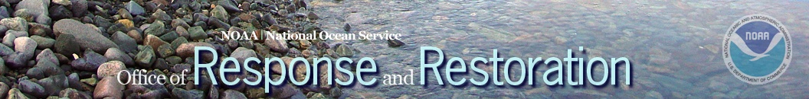
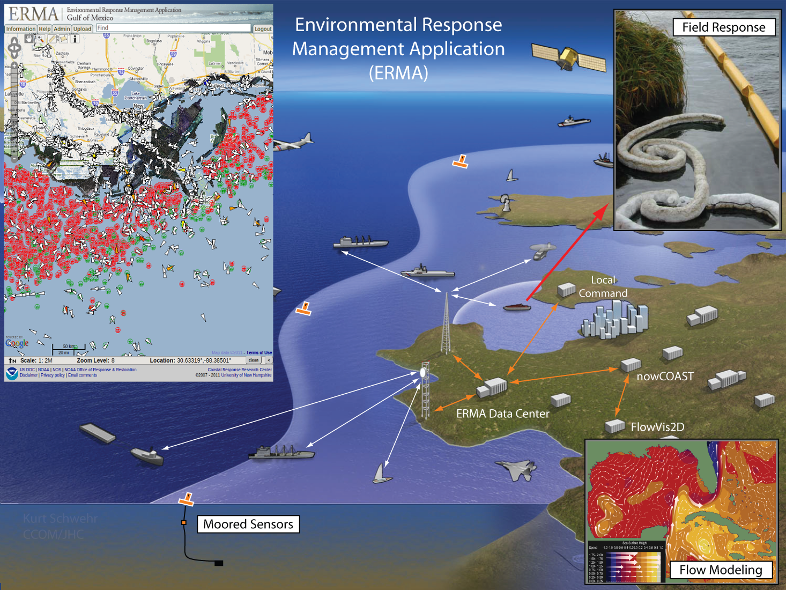
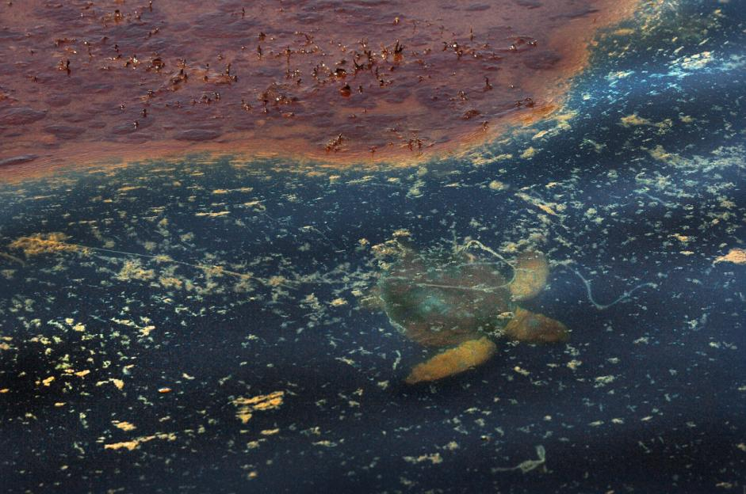
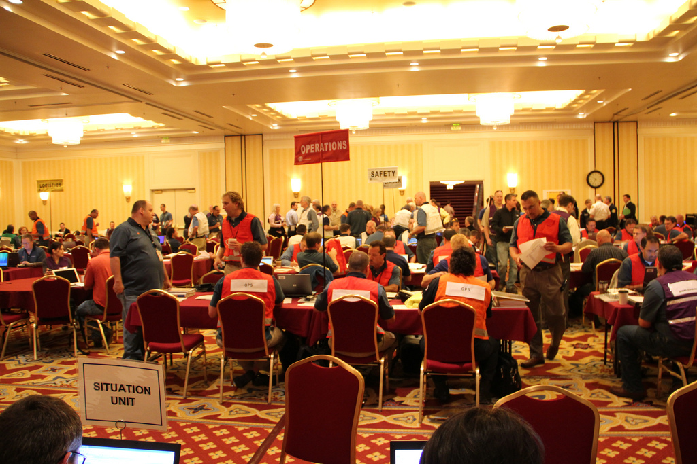
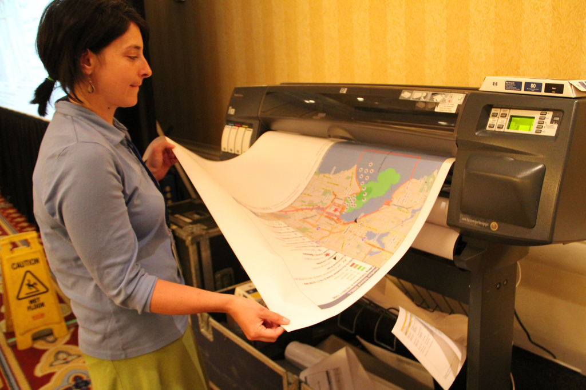
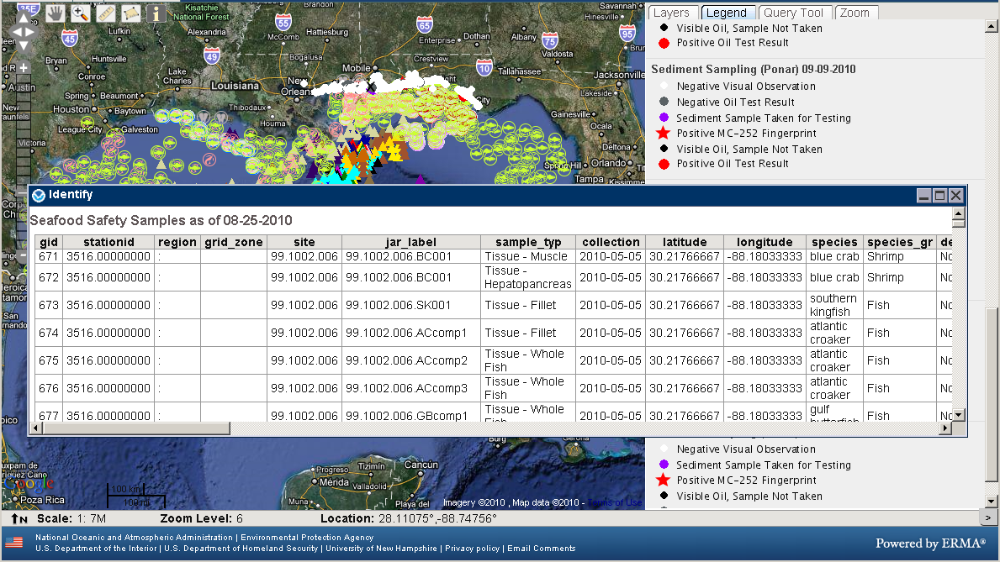
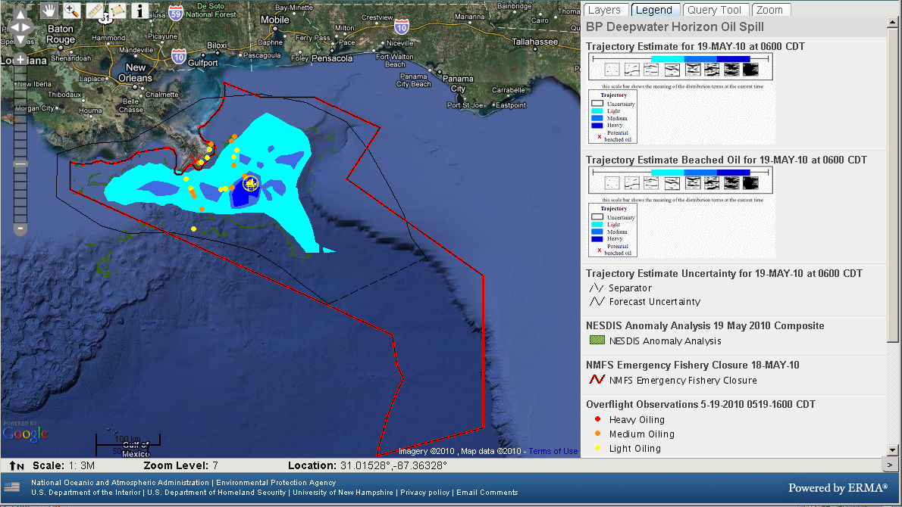
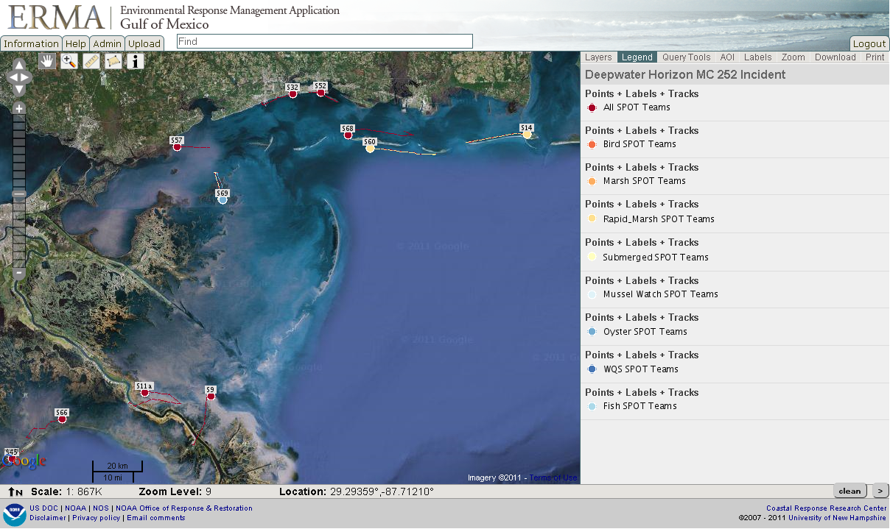

<!------------------------------------------------------------>
<!--              CUGOS - UW Cert Program Talk 2014         -->
<!--              Target talk time - 15 min                 -->
<!------------------------------------------------------------>

<!------------------------------------------------------------>
<!-- Topic: Title slide -->

<h2>Open Source GIS</h2>
<h3>A case study (me!)</h3>

    <small>Aaron Racicot - <a href="mailto:aaronr@z-pulley.com">aaronr@z-pulley.com</a>
 
<a href="http://reprojected.com">reprojected.com</a> / <a href="http://twitter.com/reprojected">@reprojected</a> 
 
<a href="https://github.com/aaronr">github.com/aaronr</a>
  
<a href="http://aaronr.github.io/uw-cert-14">aaronr.github.io/uw-cert-14</a>
</small>

<!------------------------------------------------------------>
--SLIDE--
<!-- Topic: Introduce myself -->

<h1>Who I am?</h1>

<ul>
  <li><strong>SW Developer</strong></li>
  <li><strong>Environmental Scientist</strong></li>
  <li><strong>Open Source Advocate</strong></li>
</ul>

--SUBSLIDE--

  <h3>Computer Science</h3>
  <h2>Bridging the Gap</h2>
  <h3>Environmental Science</h3>

--SUBSLIDE--

<!------------------------------------------------------------>
--SLIDE--
<!-- Topic: Introduce not only NOAA, but ORR as well -->
<!-- Topic: Why I am here... DWH and ERMA+TEAM -->

--SUBSLIDE--

<h2>The Deepwater Horizon experience</h2>

<!------------------------------------------------------------>
--SLIDE--
<!-- Topic: ERMA intro -->

<h1>Our little project...</h1>

<ul style="list-style: none;">
  <li><h2>Environmental</h2></li>
  <li><h2>Response</h2></li>
  <li><h2>Management</h2></li>
  <li><h2>Application</h2></li>
</ul>

<!------------------------------------------------------------>
--SLIDE--
<!-- Topic: What is ERMA... user app, but complex system -->

<h2>What is ERMA?</h2>

--SUBSLIDE--

<!------------------------------------------------------------>
--SLIDE--
<!-- Topic: Lead in to DWH -->

<h1>DWH</h1>

<!------------------------------------------------------------>
--SLIDE--
<!-- Topic: DWH Stats -->

<h1>DWH - By the numbers</h1>

* 11 men perished
* 200+ million gallons of oil spilled
* 580+ miles of shoreline oiled
* 1.70+ million gallons dispersants applied
* 400+ controlled burns
* 4+ million feet of containment boom and 9+ million feet of sorbent boom

<!------------------------------------------------------------>
--SLIDE--
<!-- Topic: DWH in images -->

--SUBSLIDE--

--SUBSLIDE--

--SUBSLIDE--

--SUBSLIDE--

<!------------------------------------------------------------>
--SLIDE--
<!-- Topic: ERMAs involvement with DWH -->

<h1>DWH and ERMA</h1>

* Over 180 Individual Federal/State GIS Staff
* 30-40 specifically ERMA (up from 4 normally)
* 3 ERMA developers

<!------------------------------------------------------------>
--SLIDE--
<!-- Topic: How ERMA shines as COP -->

<h1>ERMA Shines as COP</h1>
<ul>
  <li><strong>Less than 48 hours to deploy</strong></li>
  <li><strong>Scalable – 1400+ response users, 16,000+ layers (DWH)</strong></li>
  <li><strong>30,000+ layers today</strong></li>
  <li><strong>Nimble – over 850 code commits in DWH first year</strong></li>
  <li><strong>Public ERMA – over 20 million hits in 24 hours!</strong></li>
</ul>

<!------------------------------------------------------------>
--SLIDE--
<!-- Topic: ERMA Shines as the COP -->

<h2>Common Operational Picture (COP)</h2>

--SUBSLIDE--

<!------------------------------------------------------------>
--SLIDE--
<!-- Topic: ERMA screenshots showing diverse capability -->

--SUBSLIDE--

--SUBSLIDE--

--SUBSLIDE--

--SUBSLIDE--

--SUBSLIDE--

<!------------------------------------------------------------>
--SLIDE--
<!-- Topic: Big pushes forward -->

<h2>Continued push toward multi-agency</h2>
<h2>cooperation and data sharing</h2>

<h2>Scaling in new ways</h2>
<h2>(leveraging the cloud)</h2>

<!------------------------------------------------------------>
--SLIDE--
<!-- Topic: Loop around to the attendees... how does this matter? -->

<h2>So how/why does this matter to you?</h2>

<!------------------------------------------------------------>
--SLIDE--
<!-- Topic: The key is the philosophy -->

<h2>The nuts and bolts might not...</h2>
<h1>the philosophy does</h1>

--SUBSLIDE--

<h2>Focus on small teams of experts</h2>

--SUBSLIDE--

<h2>Leverage open tools,</h2>
<h2>but own the deployment</h2>
<ul>
  <li><strong>This gives us the benefit of a large community of developers</strong></li>
  <li><strong>This gives us the freedom modify and adapt when needed</strong></li>
</ul>

--SUBSLIDE--

<h2>Utilize open data</h2>
<h2>and open standards</h2>

<!------------------------------------------------------------>
--SLIDE--
<!-- Topic: A byproduct, not the reason... it saves money -->

<h1>Doing more with less</h1>
<h2>(This is a good investment for NOAA)</h2>

<!------------------------------------------------------------>
--SLIDE--
<!-- Topic: Thank You -->

<h1>Thank You !!!</h1>

